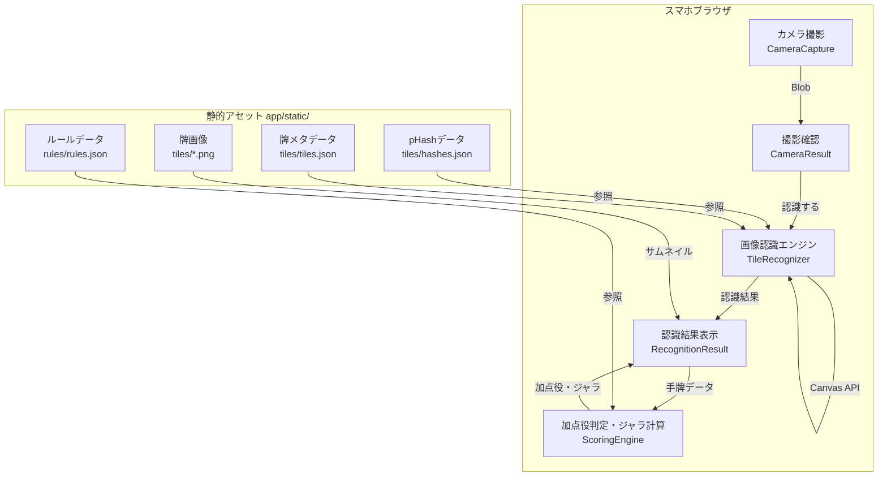

# パイ認識アプリ アーキテクチャ設計

**作成日**: 2026-03-13
**関連要件定義**: [requirements.md](../../spec/pie-recognition/requirements.md)
**ヒアリング記録**: [design-interview.md](design-interview.md)

**【信頼性レベル凡例】**:
- 🔵 **青信号**: EARS要件定義書・設計文書・ユーザヒアリングを参考にした確実な設計
- 🟡 **黄信号**: EARS要件定義書・設計文書・ユーザヒアリングから妥当な推測による設計
- 🔴 **赤信号**: EARS要件定義書・設計文書・ユーザヒアリングにない推測による設計

---

## システム概要 🔵

**信頼性**: 🔵 *要件定義書・PRD・ユーザヒアリングより*

スマホで撮影した手牌画像をブラウザ内で認識し、加点役・ジャラを表示するSPAウェブアプリ。外部サーバー通信なし、完全クライアントサイドで動作する。

## アーキテクチャパターン 🔵

**信頼性**: 🔵 *既存実装・技術スタックより*

- **パターン**: コンポーネントベースSPA（SvelteKit静的生成）
- **選択理由**: 既存のSvelteKit + adapter-static構成を維持。バックエンドなし・外部通信なしの制約に最適。

## 画像認識アーキテクチャ 🟡

**信頼性**: 🟡 *要件（ブラウザ内・3秒以内・84種類マッチング）から妥当な推測*

### 方式: 色ヒストグラム + pHash（知覚ハッシュ）ハイブリッド方式

84種類の固定牌を識別する問題であり、機械学習モデルは不要。以下の2段階で認識する。

#### 1. 牌検出（Detection）
- 撮影画像をCanvas APIで読み込み
- 横一列に並んだ牌を前提とし、輪郭検出で個別の牌領域を切り出す
- **手法**: 2値化 → 輪郭検出 → バウンディングボックス抽出
- Canvas API のみで実装可能（外部ライブラリ不要）

#### 2. 牌識別（Recognition）
- 切り出した各牌画像と、事前処理済みの84種類の参照データを比較
- **手法**: pHash（知覚ハッシュ）によるハミング距離比較
- 事前処理で84枚の牌画像をpHashに変換し、JSONとして`app/static/`に配置
- ランタイムでは撮影画像の各牌のpHashを計算し、最も近い参照データとマッチング

#### 選択理由
- Canvas API のみで動作（WASM不要、初期ロード高速）
- 84種類の固定画像マッチングにはpHashが十分な精度
- 事前処理でハッシュ計算をオフライン実行し、ランタイム負荷を最小化
- 3秒以内の性能要件を満たせる見込み

#### フォールバック計画
pHashでの精度が不十分な場合、以下の段階的改善が可能:
1. 色ヒストグラム比較を併用してスコアリング精度向上
2. OpenCV.js（WASM）によるテンプレートマッチング導入
3. 最終手段としてTensorFlow.js による軽量分類モデル

## コンポーネント構成 🔵

**信頼性**: 🔵 *既存実装・ユーザヒアリングより*

### フロントエンド

- **フレームワーク**: SvelteKit 2.50.2 + Svelte 5.51.0 🔵 *既存構成*
- **状態管理**: Svelte 5 runes (`$state`, `$props`) 🔵 *既存パターン*
- **ルーティング**: SvelteKitファイルベースルーティング 🔵 *既存構成*
- **スタイリング**: Scoped CSS（コンポーネントごと） 🔵 *既存パターン*
- **画像処理**: Canvas API + 自前のpHash実装 🟡 *技術選定から妥当な推測*

### データ層

- **牌データ**: `app/static/tiles/` に画像 + メタデータJSON 🔵 *ユーザヒアリング*
- **ルールデータ**: `app/static/rules/` に加点役・ジャラJSON 🔵 *ユーザヒアリング*
- **事前処理データ**: `app/static/tiles/hashes.json` にpHashデータ 🟡 *設計から妥当な推測*

## システム構成図 🔵

**信頼性**: 🔵 *要件定義・既存設計より*



## 画面遷移 🔵

**信頼性**: 🔵 *既存実装 + ユーザヒアリング「CameraResultは再撮影確認、認識結果は別画面」より*


| 状態 | コンポーネント | 説明 |
|------|--------------|------|
| Capture | `CameraCapture` | カメラ撮影画面（実装済み） |
| Preview | `CameraResult` | 撮影画像の確認 + 「再撮影」「認識する」ボタン（拡張） |
| Recognizing | `CameraResult`内ローディング | 認識処理中（ローディング表示） |
| Result | `RecognitionResult`（新規） | 認識結果 + 加点役 + ジャラ表示 |

## ディレクトリ構造 🔵

**信頼性**: 🔵 *既存プロジェクト構造より（新規追加分は🟡）*

```
app/
├── src/
│   ├── lib/
│   │   ├── components/
│   │   │   ├── camera/              # 既存: カメラ機能 🔵
│   │   │   │   ├── Camera.svelte
│   │   │   │   ├── CameraCapture.svelte
│   │   │   │   ├── CameraResult.svelte  # 拡張: 「認識する」ボタン追加
│   │   │   │   └── CameraLayout.svelte
│   │   │   └── recognition/         # 新規: 認識結果表示 🟡
│   │   │       └── RecognitionResult.svelte
│   │   ├── services/                 # 新規: ビジネスロジック 🟡
│   │   │   ├── tile-detector.ts      # 牌検出（画像→牌領域切り出し）
│   │   │   ├── tile-recognizer.ts    # 牌識別（切り出し画像→牌ID）
│   │   │   ├── phash.ts             # pHash計算
│   │   │   └── scoring-engine.ts     # 加点役判定・ジャラ計算
│   │   ├── types.ts                  # 型定義（拡張）
│   │   └── index.ts
│   └── routes/
│       ├── +page.svelte
│       ├── +layout.svelte
│       └── +layout.ts
├── static/
│   ├── tiles/                        # 新規: 牌データ 🔵
│   │   ├── *.png                     # 84枚の牌画像
│   │   ├── tiles.json                # 牌メタデータ
│   │   └── hashes.json               # pHashデータ（事前処理で生成）
│   └── rules/                        # 新規: ルールデータ 🔵
│       └── rules.json                # 加点役・ジャラ定義
└── ...

tools/
├── extractor/                        # 既存: 牌画像抽出
└── hasher/                           # 新規: pHash事前処理 🟡
    ├── src/main.ts
    └── package.json
```

## 非機能要件の実現方法

### パフォーマンス（3秒以内） 🔵

**信頼性**: 🔵 *ユーザヒアリング「3秒以内」+ 技術検討*

- **事前処理**: 84枚の牌画像をpHash化し、JSONとして配置（ランタイム負荷ゼロ）
- **検出高速化**: 横一列の前提で水平走査のみ実施（全面探索不要）
- **識別高速化**: pHashのハミング距離比較は整数演算のみで高速
- **並列処理**: 複数牌のpHash計算をPromise.allで並列化
- **データサイズ**: hashes.json は84件のハッシュ値のみ（< 10KB）

### セキュリティ 🔵

**信頼性**: 🔵 *ブラウザ仕様・既存実装より*

- **HTTPS必須**: カメラアクセスにHTTPSが必要（既存実装で対応済み）
- **外部通信なし**: 完全SPA、すべてのデータはstatic配信
- **画像の非送信**: 撮影画像はブラウザメモリ内のみで処理

### ユーザビリティ 🟡

**信頼性**: 🟡 *「ゲーム中の確認用」から妥当な推測*

- **片手操作**: すべてのボタンを画面下部に配置（親指で届く範囲）
- **高速表示**: 結果画面は認識完了と同時に即座に表示
- **わかりやすさ**: 各牌のサムネイル + 日本語名 + 加点役 + ジャラを一画面に表示

## 技術的制約 🔵

**信頼性**: 🔵 *要件定義・既存実装より*

### パフォーマンス制約
- 撮影から結果表示まで3秒以内
- スマホのメインスレッドでの画像処理（Web Worker未使用の場合はUI応答性に注意）

### プラットフォーム制約
- iOS Safari / Android Chrome のみ対応
- HTTPS環境必須（カメラアクセス）
- 外部サーバー通信不可

### データ制約
- 牌は84種類固定
- 手牌は8-9枚
- 横一列配置を前提

## 関連文書

- **データフロー**: [dataflow.md](dataflow.md)
- **型定義**: [interfaces.ts](interfaces.ts)
- **要件定義**: [requirements.md](../../spec/pie-recognition/requirements.md)
- **ユーザストーリー**: [user-stories.md](../../spec/pie-recognition/user-stories.md)

## 信頼性レベルサマリー

- 🔵 青信号: 18件 (72%)
- 🟡 黄信号: 7件 (28%)
- 🔴 赤信号: 0件 (0%)

**品質評価**: 高品質
