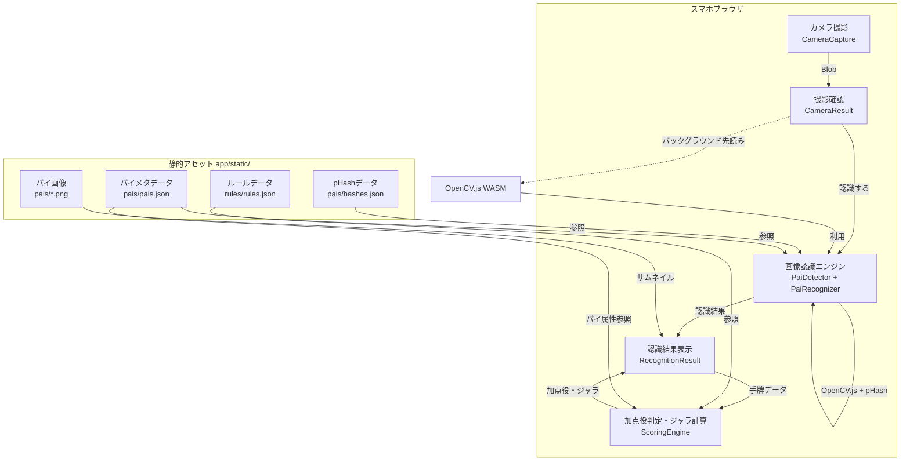
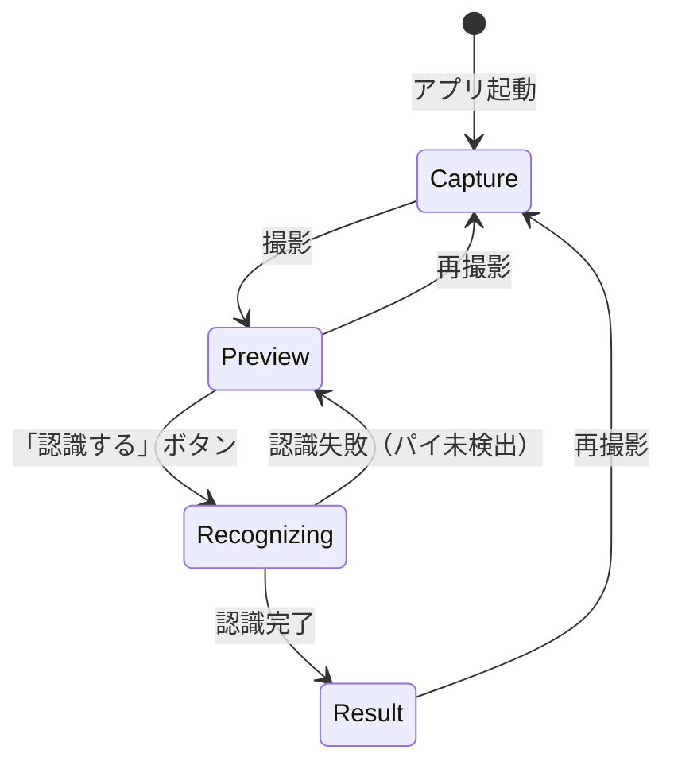

# パイ認識アプリ アーキテクチャ設計

**作成日**: 2026-03-14
**関連要件定義**: [requirements.md](../../spec/pie-recognition/requirements.md)
**ヒアリング記録**: [design-interview.md](design-interview.md)

**【信頼性レベル凡例】**:
- 🔵 **青信号**: EARS要件定義書・設計文書・ユーザヒアリングを参考にした確実な設計
- 🟡 **黄信号**: EARS要件定義書・設計文書・ユーザヒアリングから妥当な推測による設計
- 🔴 **赤信号**: EARS要件定義書・設計文書・ユーザヒアリングにない推測による設計

---

## システム概要 🔵

**信頼性**: 🔵 *要件定義書・PRD・ユーザヒアリングより*

スマホで撮影した手牌画像をブラウザ内で認識し、加点役・ジャラを表示するSPAウェブアプリ。外部サーバー通信なし、完全クライアントサイドで動作する。

## アーキテクチャパターン 🔵

**信頼性**: 🔵 *既存実装・技術スタックより*

- **パターン**: コンポーネントベースSPA（SvelteKit静的生成）
- **選択理由**: 既存のSvelteKit + adapter-static構成を維持。バックエンドなし・外部通信なしの制約に最適。

## 画像認識アーキテクチャ 🔵

**信頼性**: 🔵 *要件定義・ユーザヒアリング・設計ヒアリングより確定*

### 方式: OpenCV.js（検出） + pHash（識別）

84種類の固定牌を識別する問題であり、機械学習モデルは不要。以下の2段階で認識する。

#### 1. パイ検出（Detection）— OpenCV.js

- 撮影画像から個別のパイ領域を切り出す
- **手法**: OpenCV.js の `cv.findContours()` による輪郭検出
- グレースケール変換 → 画像縮小（認識用） → 2値化（大津の方法） → 輪郭検出 → バウンディングボックス抽出 → アスペクト比フィルタ
- **任意の角度に対応**: 横一列・縦一列・斜め配置すべてを検出可能
- OpenCV.js（WASM ~8MB）はプレビュー画面表示時にバックグラウンドで先読みロード開始し、「認識する」ボタンタップ時に利用可能とする
- **メモリ管理**: OpenCV.js の Mat オブジェクトは処理完了後に必ず `mat.delete()` で解放する。try-finally パターンで確実にクリーンアップを行う

#### 2. パイ識別（Recognition）— pHash

- 切り出した各パイ画像と、事前処理済みの84種類の参照データを比較
- **手法**: pHash（知覚ハッシュ）によるハミング距離比較
- 事前処理で84枚のパイ画像をpHashに変換し、JSONとして`app/static/`に配置
- ランタイムでは撮影画像の各パイのpHashを計算し、最も近い参照データとマッチング

#### 画像の前処理 🟡

**信頼性**: 🟡 *パフォーマンス要件から妥当な推測*

- 撮影画像（1920x1080）を検出処理前に縮小する（例: 長辺960px）
- 縮小により OpenCV.js の処理負荷を低減し、3秒以内の目標達成を支援
- 縮小後もパイの検出精度に影響がないサイズを選定（実装時に調整）

#### 検出にOpenCV.jsを選択した理由

- **傾き対応**: 片手撮影では±15°以上の傾きが発生しうる。Canvas API水平走査（±5°）では不十分
- **実装コスト**: `cv.findContours()` + `cv.boundingRect()` で~30行。Canvas API自前実装（連結成分ラベリング）は~300-400行
- **信頼性**: OpenCV.jsは広く使われた実績ある画像処理ライブラリ
- **初期ロードへの影響**: WASM ~8MBはプレビュー画面でバックグラウンド先読みし、撮影画面の表示速度には影響なし。2回目以降はブラウザキャッシュで即座にロード

#### 識別にpHashを選択した理由

- **問題の性質に合致**: 84種類の固定画像のどれに最も似ているかを判定する1対Nの分類問題
- **軽量・高速**: ハミング距離（ビット演算）のみで84回比較。テンプレートマッチ（84回全面走査）と比べ圧倒的に高速
- **事前処理との相性**: 84枚分のハッシュ値を事前計算しJSONに格納（< 10KB）

#### フォールバック計画

pHashでの精度が不十分な場合、以下の段階的改善が可能:
1. 色ヒストグラム比較を併用してスコアリング精度向上
2. OpenCV.jsのテンプレートマッチング（部分的に活用）
3. 最終手段としてTensorFlow.js による軽量分類モデル

## 加点役・ジャラ判定アーキテクチャ 🔵

**信頼性**: 🔵 *manual.pdf解読済み・ユーザヒアリングより確定*

### 方式: パイ属性ベースのルールマッチング

各パイにユニット・学年・誕生月などの属性を持たせ、手牌内で属性が一致する組み合わせにより加点役を判定する。

#### 設計方針

- **パイ属性データ**: 各パイに属性リスト（ユニット、学年、誕生月など）を持たせる
- **拡張性**: JSONで管理し、後から新しい加点役を容易に追加可能
- **加点役数**: 30個以上の加点役をサポート
- **ジャラ計算**: 各加点役は固定点数を持ち、該当する加点役のジャラを単純合算
- **判定ロジック**: 手牌のパイIDから属性を参照し、各加点役の条件（同一属性のパイが一定枚数等）を評価

## コンポーネント構成 🔵

**信頼性**: 🔵 *既存実装・ユーザヒアリングより*

### フロントエンド

- **フレームワーク**: SvelteKit 2.50.2 + Svelte 5.51.0 🔵 *既存構成*
- **状態管理**: Svelte 5 runes (`$state`, `$props`) 🔵 *既存パターン*
- **ルーティング**: SvelteKitファイルベースルーティング 🔵 *既存構成*
- **スタイリング**: Scoped CSS（コンポーネントごと） 🔵 *既存パターン*
- **画像処理**: OpenCV.js（検出） + pHash自前実装（識別） 🔵 *設計ヒアリングより確定*

### データ層

- **パイデータ**: `app/static/pais/` に画像 + メタデータJSON 🔵 *ユーザヒアリング*
- **ルールデータ**: `app/static/rules/` に加点役・ジャラJSON 🔵 *ユーザヒアリング*
- **事前処理データ**: `app/static/pais/hashes.json` にpHashデータ 🟡 *設計から妥当な推測*

## システム構成図 🔵

**信頼性**: 🔵 *要件定義・既存設計より*



## 画面遷移 🔵

**信頼性**: 🔵 *既存実装 + ユーザヒアリング「CameraResultは再撮影確認、認識結果は別画面」より*



| 状態 | コンポーネント | 説明 |
|------|--------------|------|
| Capture | `CameraCapture` | カメラ撮影画面（実装済み） |
| Preview | `CameraResult` | 撮影画像の確認 + 「再撮影」「認識する」ボタン（拡張） |
| Recognizing | `CameraResult`内ローディング | 認識処理中（ローディング表示） |
| Result | `RecognitionResult`（新規） | 認識結果 + 加点役 + ジャラ表示 |

## ディレクトリ構造 🔵

**信頼性**: 🔵 *既存プロジェクト構造より（新規追加分は🟡）*

```
app/
├── src/
│   ├── lib/
│   │   ├── components/
│   │   │   ├── camera/              # 既存: カメラ機能 🔵
│   │   │   │   ├── Camera.svelte
│   │   │   │   ├── CameraCapture.svelte
│   │   │   │   ├── CameraResult.svelte  # 拡張: 「認識する」ボタン追加
│   │   │   │   └── CameraLayout.svelte
│   │   │   └── recognition/         # 新規: 認識結果表示 🟡
│   │   │       └── RecognitionResult.svelte
│   │   ├── services/                 # 新規: ビジネスロジック 🔵
│   │   │   ├── opencv-loader.ts      # OpenCV.js 遅延ロード・先読み
│   │   │   ├── pai-detector.ts       # パイ検出（OpenCV.js findContours）
│   │   │   ├── pai-recognizer.ts     # パイ識別（pHashマッチング）
│   │   │   ├── phash.ts             # pHash計算
│   │   │   └── scoring-engine.ts     # 加点役判定・ジャラ計算
│   │   ├── types.ts                  # 型定義（拡張）
│   │   └── index.ts
│   └── routes/
│       ├── +page.svelte
│       ├── +layout.svelte
│       └── +layout.ts
├── static/
│   ├── pais/                         # 新規: パイデータ 🔵
│   │   ├── *.png                     # 84枚のパイ画像
│   │   ├── pais.json                 # パイメタデータ（属性情報含む）
│   │   └── hashes.json               # pHashデータ（事前処理で生成）
│   └── rules/                        # 新規: ルールデータ 🔵
│       └── rules.json                # 加点役・ジャラ定義
└── ...

tools/
├── extractor/                        # 既存: パイ画像抽出
└── hasher/                           # 新規: pHash事前処理 🟡
    ├── src/main.ts
    └── package.json
```

## 非機能要件の実現方法

### パフォーマンス（3秒以内） 🔵

**信頼性**: 🔵 *ユーザヒアリング「3秒以内」+ 技術検討*

- **事前処理**: 84枚のパイ画像をpHash化し、JSONとして配置（ランタイム負荷ゼロ）
- **画像縮小**: 撮影画像を検出前に縮小し、OpenCV.js の処理負荷を低減 🟡
- **検出高速化**: OpenCV.js findContoursは最適化済みWASMで高速動作
- **識別高速化**: pHashのハミング距離比較は整数演算のみで高速
- **先読みロード**: OpenCV.js WASMはプレビュー画面表示時にバックグラウンドで先読みロード開始（初回利用時の待ち時間を削減）
- **データサイズ**: hashes.json は84件のハッシュ値のみ（< 10KB）、OpenCV.js WASM ~8MB（ブラウザキャッシュ可）
- **初回アクセス時の考慮**: WASM未キャッシュの初回は8MBのダウンロードが発生する。プレビュー画面での先読みにより、ユーザーが画像を確認している間にダウンロードを完了させる 🟡

### セキュリティ 🔵

**信頼性**: 🔵 *ブラウザ仕様・既存実装より*

- **HTTPS必須**: カメラアクセスにHTTPSが必要（既存実装で対応済み）
- **外部通信なし**: 完全SPA、すべてのデータはstatic配信
- **画像の非送信**: 撮影画像はブラウザメモリ内のみで処理

### ユーザビリティ 🟡

**信頼性**: 🟡 *「ゲーム中の確認用」から妥当な推測*

- **片手操作**: すべてのボタンを画面下部に配置（親指で届く範囲）
- **高速表示**: 結果画面は認識完了と同時に即座に表示
- **わかりやすさ**: 各パイのサムネイル + 日本語名 + 加点役 + ジャラを一画面に表示

## 技術的制約 🔵

**信頼性**: 🔵 *要件定義・既存実装より*

### パフォーマンス制約
- 撮影から結果表示まで3秒以内
- スマホのメインスレッドでの画像処理（UI応答性に注意）
- OpenCV.js WASM 初回ダウンロード ~8MB（先読みで緩和）

### プラットフォーム制約
- iOS Safari / Android Chrome のみ対応
- HTTPS環境必須（カメラアクセス）
- 外部サーバー通信不可

### データ制約
- パイは84種類固定
- 手牌は8-9枚
- パイの配置は任意角度に対応（横・縦・斜め）
- 加点役は30個以上（JSONで拡張可能）

### リソース管理制約 🟡
- OpenCV.js の Mat オブジェクトは明示的に `delete()` で解放が必要（GC対象外）
- 処理完了後のメモリリークを防ぐため、try-finally パターンを徹底する

## 関連文書

- **データフロー**: [dataflow.md](dataflow.md)
- **型定義**: [interfaces.ts](interfaces.ts)
- **要件定義**: [requirements.md](../../spec/pie-recognition/requirements.md)
- **ユーザストーリー**: [user-stories.md](../../spec/pie-recognition/user-stories.md)

## 信頼性レベルサマリー

- 🔵 青信号: 24件 (80%)
- 🟡 黄信号: 6件 (20%)
- 🔴 赤信号: 0件 (0%)

**品質評価**: 高品質
