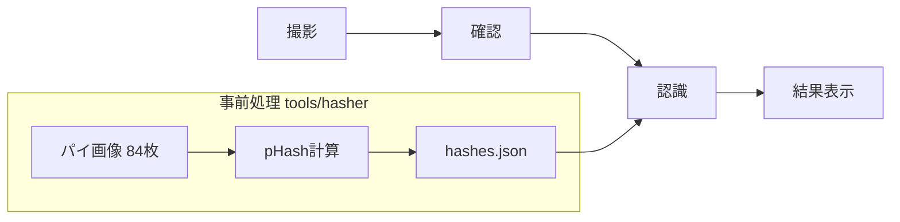
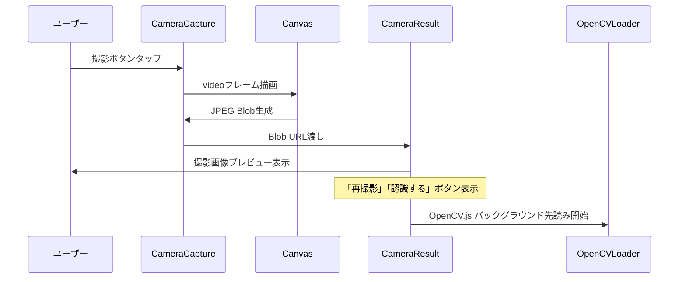
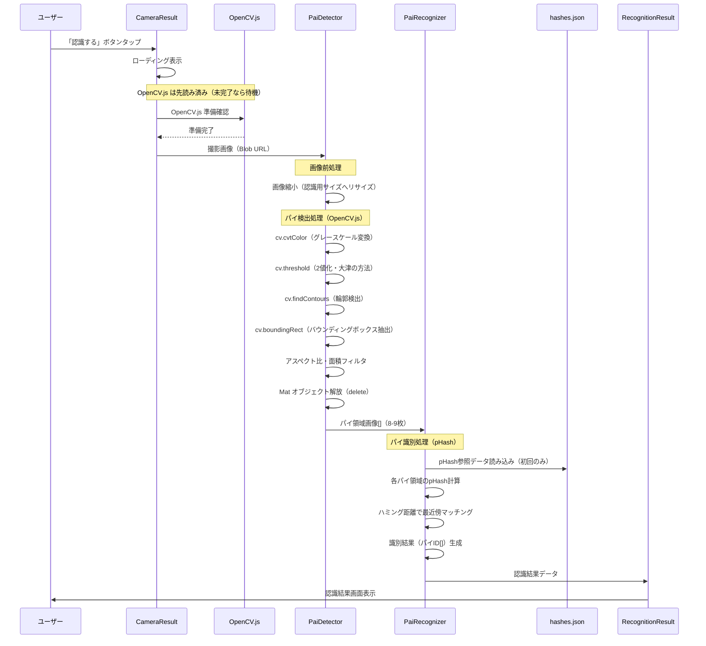
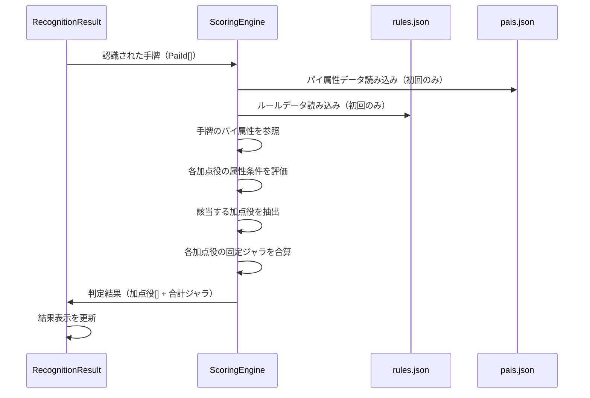
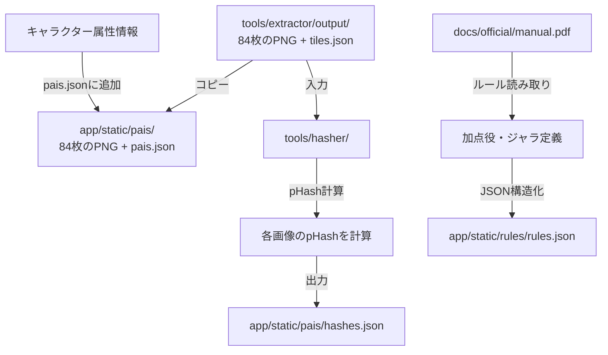
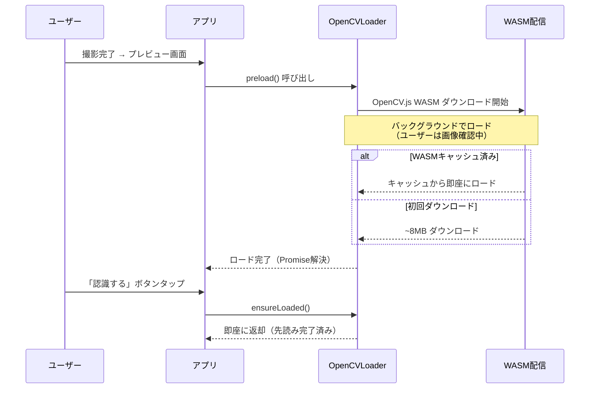
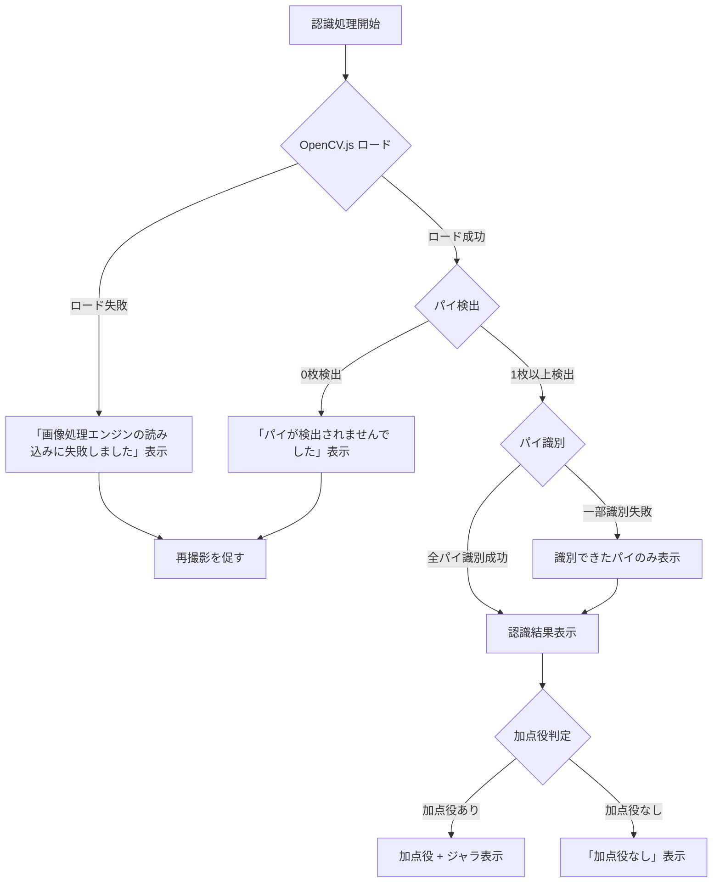
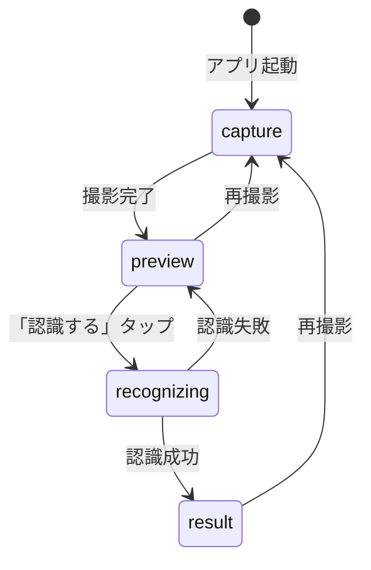
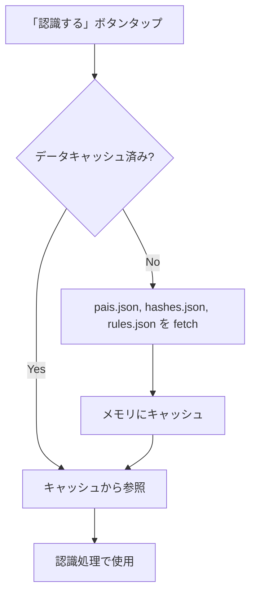

# パイ認識アプリ データフロー図

**作成日**: 2026-03-14
**関連アーキテクチャ**: [architecture.md](architecture.md)
**関連要件定義**: [requirements.md](../../spec/pie-recognition/requirements.md)

**【信頼性レベル凡例】**:
- 🔵 **青信号**: EARS要件定義書・設計文書・ユーザヒアリングを参考にした確実なフロー
- 🟡 **黄信号**: EARS要件定義書・設計文書・ユーザヒアリングから妥当な推測によるフロー
- 🔴 **赤信号**: EARS要件定義書・設計文書・ユーザヒアリングにない推測によるフロー

---

## システム全体のデータフロー 🔵

**信頼性**: 🔵 *要件定義・ユーザーストーリーより*



## 主要機能のデータフロー

### 機能1: パイの撮影と確認 🔵

**信頼性**: 🔵 *既存実装（CameraCapture → CameraResult）より*

**関連要件**: REQ-001, REQ-202



**詳細ステップ**:
1. ユーザーが撮影ボタンをタップ
2. videoフレームをCanvasに描画し、JPEG Blobを生成（既存実装）
3. CameraResult画面で撮影画像をプレビュー表示
4. **プレビュー画面表示と同時にOpenCV.js WASMのバックグラウンド先読みを開始**
5. ユーザーは「再撮影」または「認識する」を選択

---

### 機能2: 画像認識パイプライン 🔵

**信頼性**: 🔵 *要件定義・設計ヒアリングより確定*

**関連要件**: REQ-001, REQ-002, REQ-007, REQ-008, NFR-001



**詳細ステップ**:
1. OpenCV.js の準備を確認（先読みにより通常は即座に利用可能）
2. 撮影画像を検出用サイズに縮小
3. 縮小画像をOpenCV.jsのMatに読み込み
4. **パイ検出**: グレースケール → 2値化 → `cv.findContours()` で輪郭検出 → バウンディングボックス抽出
5. アスペクト比・面積フィルタでパイらしい矩形のみ抽出（8-9枚想定）
6. **Matオブジェクトを解放**（メモリリーク防止）
7. **パイ識別**: 各切り出し画像のpHashを計算
8. 事前処理済みの84種類のpHashとハミング距離を比較
9. 最小距離のパイIDを識別結果として返す

---

### 機能3: 加点役判定・ジャラ計算 🔵

**信頼性**: 🔵 *要件定義REQ-004, REQ-005, REQ-006 + manual.pdf解読済み + ユーザヒアリングより確定*

**関連要件**: REQ-004, REQ-005, REQ-006



**詳細ステップ**:
1. 認識された手牌のID配列をScoringEngineに渡す
2. pais.jsonから各パイの属性データ（ユニット・学年・誕生月等）を参照（初回のみ、以降キャッシュ）
3. rules.jsonから加点役の定義を読み込み（初回のみ、以降キャッシュ）
4. 手牌の各パイの属性を取得し、各加点役の条件（同一属性のパイが一定枚数等）を評価
5. 該当する加点役を抽出し、各加点役の固定ジャラ値を単純合算
6. 結果画面に加点役名・個別ジャラ・合計ジャラを表示

---

### 機能4: 事前処理パイプライン（開発時） 🔵

**信頼性**: 🔵 *PRD「事前に画像をベクトル化、ハッシュ化」+ REQ-301, REQ-405より*

**関連要件**: REQ-301, REQ-404, REQ-405



**詳細ステップ**:
1. `tools/extractor/output/` からパイ画像84枚 + tiles.json を `app/static/pais/` にコピー（pais.jsonにリネーム）
2. pais.jsonに各パイの属性情報（ユニット・学年・誕生月等）を追加
3. `tools/hasher/` で84枚の画像を読み込み、pHashを計算
4. `app/static/pais/hashes.json` に `{ filename: pHashValue }` 形式で出力
5. manual.pdfからルールを解読し、`app/static/rules/rules.json` に構造化

---

## データ処理パターン

### 同期処理 🔵

**信頼性**: 🔵 *アーキテクチャ設計より*

- **加点役判定**: パイ属性とルールデータの照合はCPU軽量のため同期処理
- **ジャラ計算**: 固定点数の単純加算処理のため同期処理
- **pHash比較**: ハミング距離計算は整数演算のみで高速

### 非同期処理 🔵

**信頼性**: 🔵 *設計ヒアリング・技術検討より確定*

- **OpenCV.js先読み**: WASM ~8MBをプレビュー画面表示時にバックグラウンドでロード開始（`import()` による動的インポート）
- **画像読み込み**: Canvas APIでの画像ロードは非同期
- **パイ検出**: OpenCV.jsの処理は同期だが、全体フローはasync/awaitで管理
- **hashes.json/pais.json/rules.jsonの読み込み**: fetch()で非同期取得（初回のみ、以降メモリキャッシュ）

## OpenCV.js ロード戦略 🔵

**信頼性**: 🔵 *設計ヒアリング + パフォーマンス要件より*



**ロードタイミング**:
1. **プレビュー画面表示時**: `preload()` でバックグラウンドロード開始
2. **「認識する」ボタンタップ時**: `ensureLoaded()` でロード完了を確認
   - 先読み完了済み → 即座に処理開始
   - 先読み未完了 → ロード完了まで待機（ローディング表示）
3. **2回目以降**: ブラウザキャッシュにより即座にロード

## エラーハンドリングフロー 🟡

**信頼性**: 🟡 *既存実装パターン + 一般的なUXから妥当な推測*



## 状態管理フロー 🔵

**信頼性**: 🔵 *既存実装パターン（Svelte 5 runes）より*



**Camera.svelte の状態拡張**:
```
type CameraMode = 'capture' | 'preview' | 'recognizing' | 'result';
```

既存の `'capture' | 'result'` を4状態に拡張:
- `capture`: カメラ撮影画面
- `preview`: 撮影画像確認（既存の `result` を改名）
- `recognizing`: 認識処理中（ローディング）
- `result`: 認識結果表示（新規）

## 静的データの読み込み戦略 🟡

**信頼性**: 🟡 *パフォーマンス要件から妥当な推測*



- **初回認識時**: pais.json, hashes.json, rules.json を fetch してメモリにキャッシュ
- **以降の認識**: キャッシュ済みデータを参照（追加fetch不要）
- **データサイズ見積り**:
  - pais.json: ~10KB（84件のメタデータ + 属性情報）
  - hashes.json: ~10KB（84件のpHash値）
  - rules.json: ~10-30KB（30個以上の加点役定義）

## メモリ管理 🟡

**信頼性**: 🟡 *OpenCV.js の仕様から妥当な推測*

OpenCV.js の Mat オブジェクトは JavaScript の GC 対象外（WASM ヒープ上に確保される）のため、明示的な解放が必要。

```
async function detectPais(imageSource: string): Promise<DetectedRegion[]> {
  const src = cv.imread(canvas);
  const gray = new cv.Mat();
  const binary = new cv.Mat();
  try {
    // 検出処理...
    return regions;
  } finally {
    src.delete();
    gray.delete();
    binary.delete();
  }
}
```

**解放タイミング**:
- 各検出処理の完了時に、使用した全 Mat を `delete()` で解放
- try-finally パターンにより、エラー発生時も確実に解放
- 認識結果は DetectedRegion（プレーンオブジェクト）に変換してから Mat を解放

## 関連文書

- **アーキテクチャ**: [architecture.md](architecture.md)
- **型定義**: [interfaces.ts](interfaces.ts)
- **要件定義**: [requirements.md](../../spec/pie-recognition/requirements.md)

## 信頼性レベルサマリー

- 🔵 青信号: 11件 (73%)
- 🟡 黄信号: 4件 (27%)
- 🔴 赤信号: 0件 (0%)

**品質評価**: 高品質
