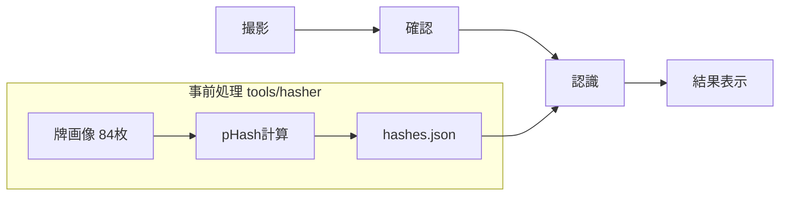
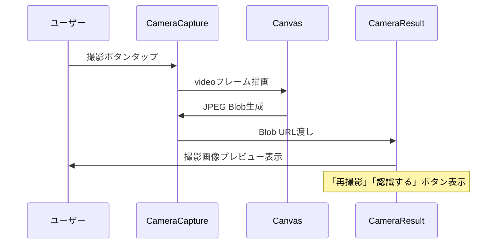
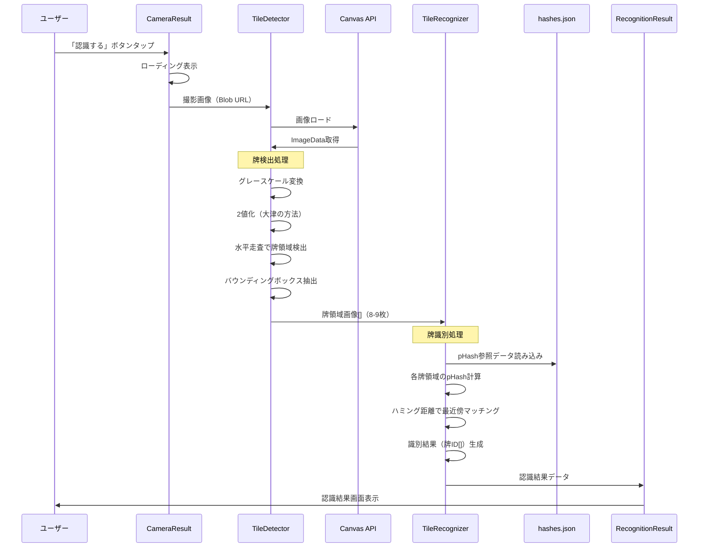
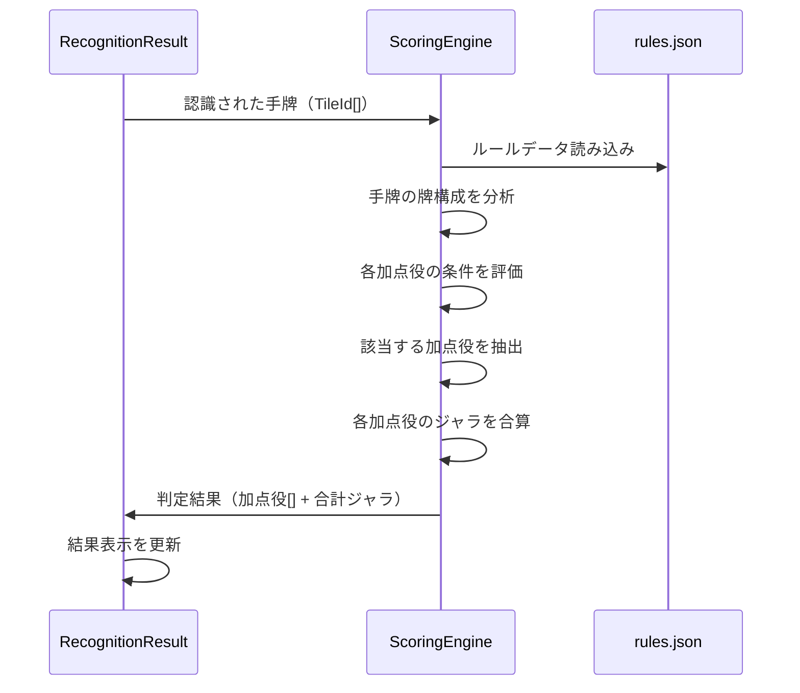
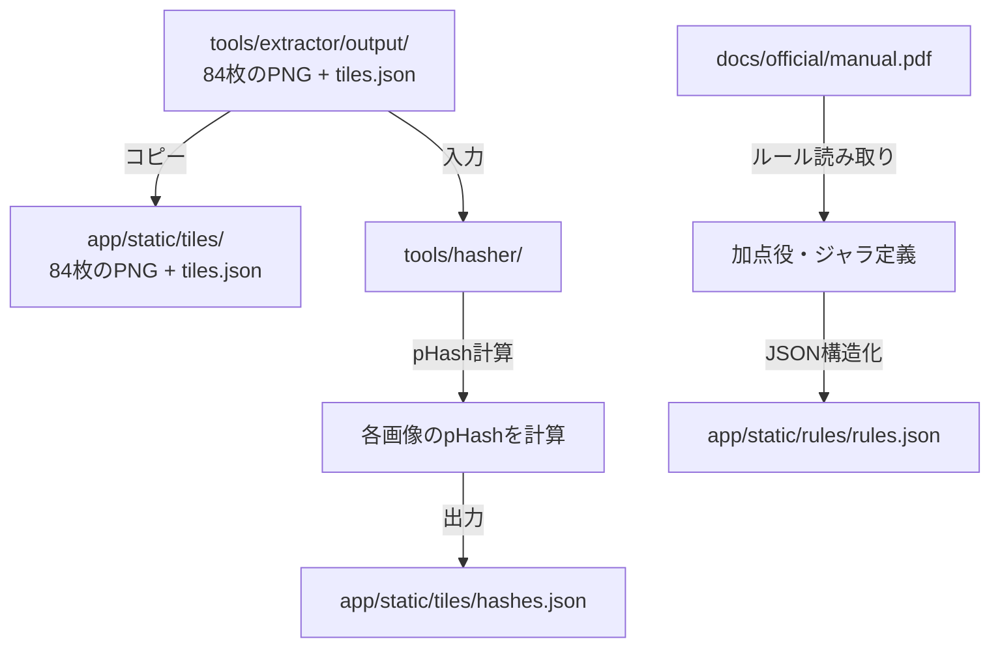
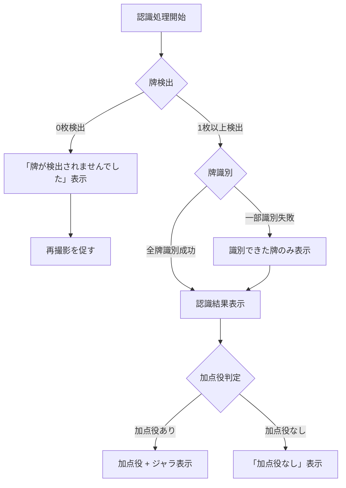
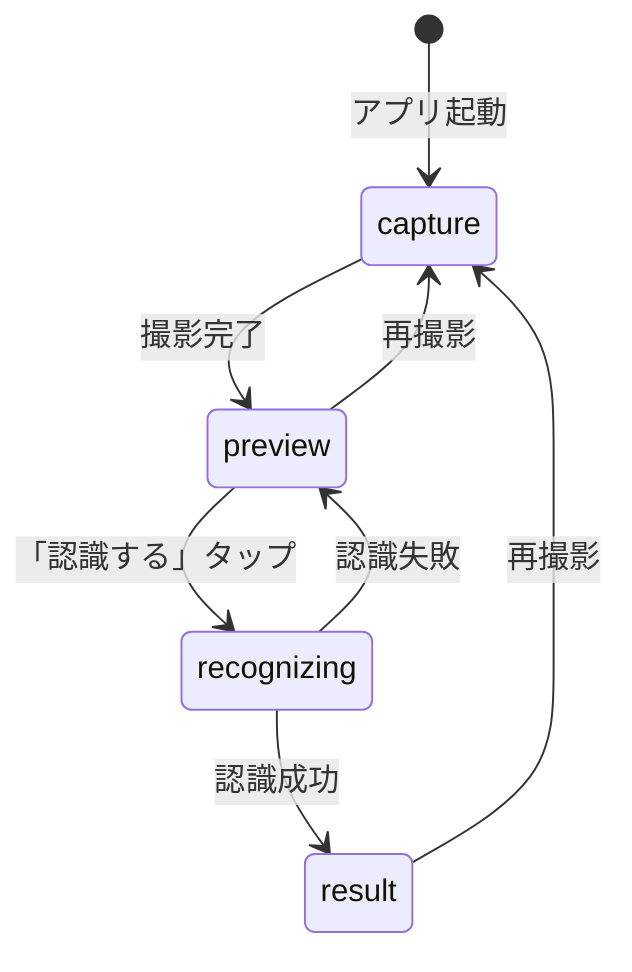
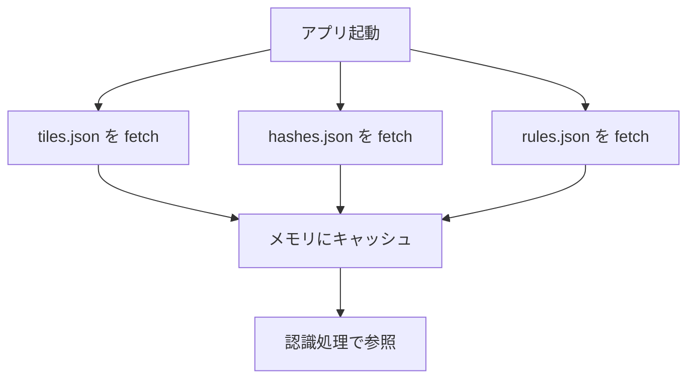

# パイ認識アプリ データフロー図

**作成日**: 2026-03-13
**関連アーキテクチャ**: [architecture.md](architecture.md)
**関連要件定義**: [requirements.md](../../spec/pie-recognition/requirements.md)

**【信頼性レベル凡例】**:
- 🔵 **青信号**: EARS要件定義書・設計文書・ユーザヒアリングを参考にした確実なフロー
- 🟡 **黄信号**: EARS要件定義書・設計文書・ユーザヒアリングから妥当な推測によるフロー
- 🔴 **赤信号**: EARS要件定義書・設計文書・ユーザヒアリングにない推測によるフロー

---

## システム全体のデータフロー 🔵

**信頼性**: 🔵 *要件定義・ユーザーストーリーより*



## 主要機能のデータフロー

### 機能1: 牌の撮影と確認 🔵

**信頼性**: 🔵 *既存実装（CameraCapture → CameraResult）より*

**関連要件**: REQ-001, REQ-202



**詳細ステップ**:
1. ユーザーが撮影ボタンをタップ
2. videoフレームをCanvasに描画し、JPEG Blobを生成（既存実装）
3. CameraResult画面で撮影画像をプレビュー表示
4. ユーザーは「再撮影」または「認識する」を選択

---

### 機能2: 画像認識パイプライン 🟡

**信頼性**: 🟡 *要件（ブラウザ内・3秒以内）+ 技術検討から妥当な推測*

**関連要件**: REQ-001, REQ-002, REQ-007, NFR-001



**詳細ステップ**:
1. 撮影画像をCanvas APIで読み込み、ImageDataを取得
2. **牌検出**: グレースケール → 2値化 → 水平走査で矩形領域を検出
3. 検出した矩形をバウンディングボックスとして切り出し（8-9枚想定）
4. **牌識別**: 各切り出し画像のpHashを計算
5. 事前処理済みの84種類のpHashとハミング距離を比較
6. 最小距離の牌IDを識別結果として返す

---

### 機能3: 加点役判定・ジャラ計算 🔵

**信頼性**: 🔵 *要件定義REQ-004, REQ-005, REQ-006 + ユーザヒアリング「JSONで管理」より*

**関連要件**: REQ-004, REQ-005, REQ-006



**詳細ステップ**:
1. 認識された手牌のID配列をScoringEngineに渡す
2. rules.jsonから加点役の定義を読み込み
3. 手牌の構成（グループ別枚数、キャラクター組み合わせ等）を分析
4. 各加点役の条件式を評価し、該当する加点役を抽出
5. 各加点役のジャラ値を合算し、合計ジャラを計算
6. 結果画面に加点役名・個別ジャラ・合計ジャラを表示

---

### 機能4: 事前処理パイプライン（開発時） 🔵

**信頼性**: 🔵 *PRD「事前に画像をベクトル化、ハッシュ化」+ REQ-301, REQ-405より*

**関連要件**: REQ-301, REQ-404, REQ-405



**詳細ステップ**:
1. `tools/extractor/output/` から牌画像84枚 + tiles.json を `app/static/tiles/` にコピー
2. `tools/hasher/` で84枚の画像を読み込み、pHashを計算
3. `app/static/tiles/hashes.json` に `{ filename: pHashValue }` 形式で出力
4. manual.pdfからルールを解読し、`app/static/rules/rules.json` に構造化

---

## データ処理パターン

### 同期処理 🔵

**信頼性**: 🔵 *アーキテクチャ設計より*

- **加点役判定**: ルールデータとの照合はCPU軽量のため同期処理
- **ジャラ計算**: 単純な加算処理のため同期処理
- **pHash比較**: ハミング距離計算は整数演算のみで高速

### 非同期処理 🟡

**信頼性**: 🟡 *パフォーマンス要件から妥当な推測*

- **画像読み込み**: Canvas APIでの画像ロードは非同期
- **牌検出**: ImageData処理は同期だが、全体フローはasync/awaitで管理
- **hashes.json/rules.jsonの読み込み**: fetch()で非同期取得（初回のみ）

## エラーハンドリングフロー 🟡

**信頼性**: 🟡 *既存実装パターン + 一般的なUXから妥当な推測*



## 状態管理フロー 🔵

**信頼性**: 🔵 *既存実装パターン（Svelte 5 runes）より*



**Camera.svelte の状態拡張**:
```
type CameraMode = 'capture' | 'preview' | 'recognizing' | 'result';
```

既存の `'capture' | 'result'` を4状態に拡張:
- `capture`: カメラ撮影画面
- `preview`: 撮影画像確認（既存の `result` を改名）
- `recognizing`: 認識処理中（ローディング）
- `result`: 認識結果表示（新規）

## 静的データの読み込み戦略 🟡

**信頼性**: 🟡 *パフォーマンス要件から妥当な推測*



- **初回ロード時**: tiles.json, hashes.json, rules.json を fetch してメモリにキャッシュ
- **以降の認識**: キャッシュ済みデータを参照（追加fetch不要）
- **データサイズ見積り**:
  - tiles.json: ~5KB（84件のメタデータ）
  - hashes.json: ~10KB（84件のpHash値）
  - rules.json: ~5-20KB（加点役定義、要manual.pdf解読）

## 関連文書

- **アーキテクチャ**: [architecture.md](architecture.md)
- **型定義**: [interfaces.ts](interfaces.ts)
- **要件定義**: [requirements.md](../../spec/pie-recognition/requirements.md)

## 信頼性レベルサマリー

- 🔵 青信号: 9件 (64%)
- 🟡 黄信号: 5件 (36%)
- 🔴 赤信号: 0件 (0%)

**品質評価**: 高品質
